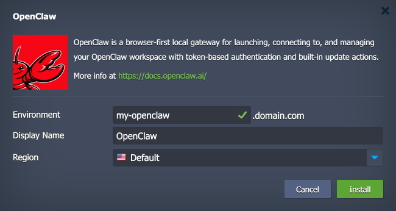
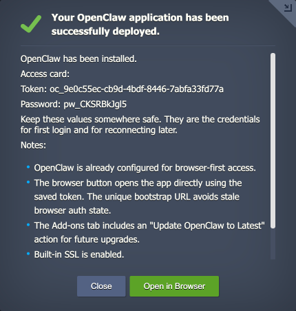
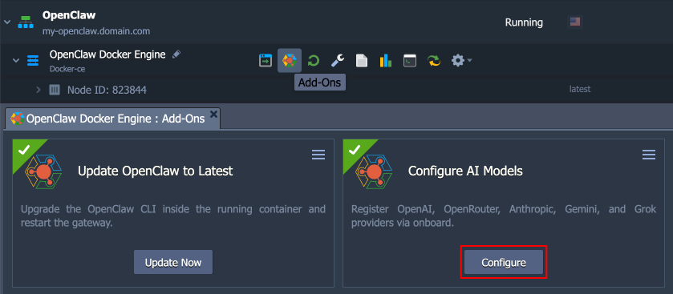
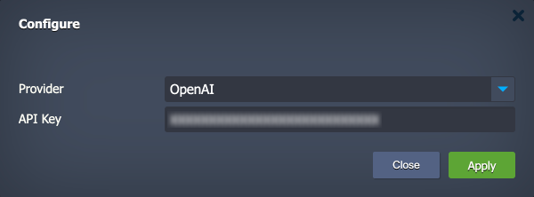
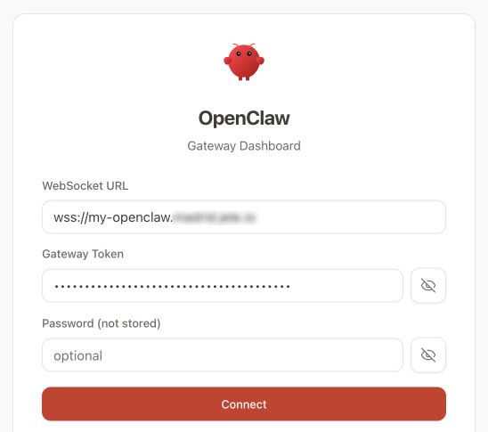
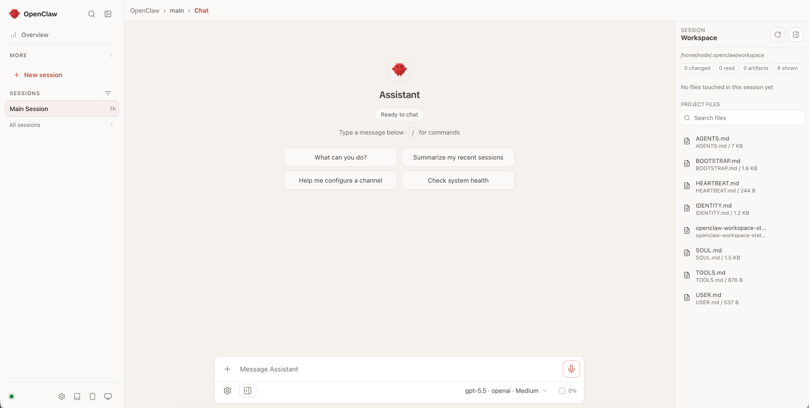

# OpenClaw

The application package deploys [OpenClaw](https://docs.openclaw.ai/) — a browser-first local gateway for launching, connecting to, and managing an OpenClaw workspace.

The package performs the following actions:

- Provisions a Docker CE container at application server layer
- Installs Node.js and OpenClaw inside the container
- Adds a persistent volume for the container at `/data/openclaw`
- Exposes the gateway on port **80** (mapped to container port **18789**)
- Installs two add-ons to simplify management:
  - **Configure AI Models** to register AI model providers
  - **Update OpenClaw to Latest** to keep the gateway up-to-date

## Deployment to Cloud

To get your OpenClaw solution, click the "**Deploy to Cloud**" button below, specify your email address within the widget, choose one of the [Virtuozzo Public Cloud Providers](https://www.virtuozzo.com/paas-partners/), and confirm by clicking **Install**.

> If you already have a Virtuozzo Application Management (V/AM) account, you can deploy this solution from the [Marketplace](https://www.virtuozzo.com/application-platform-docs/marketplace/) or [import](https://www.virtuozzo.com/application-platform-docs/environment-import/) a manifest file from this repository.

## Installation Process

1\. In the opened installation window at the V/AM dashboard, provide a preferred environment and display names, choose a region (if available), and confirm the installation.

Your OpenClaw application will be automatically installed in a few minutes.

2\. On success, note the **Token** and **Password** from the install result — they are required for first login and reconnection.

> **Note:** Installation configures the gateway only. OpenClaw UI is accessible, but AI model providers are **not** set up at this stage yet.

3\. Register at least one AI model provider to use the gateway.

1. Go to **Add-Ons** for the OpenClaw application and find the **Configure AI Models** add-on.
2. Click **Configure** and select a **Provider**:
    - OpenAI
    - OpenRouter
    - Anthropic
    - Gemini (Google)
    - Grok (xAI)
3. Enter an **API Key** for the selected provider.
4. Click **Apply** to confirm.

> **Note:** Alternatively, you can use environment variables on the node for API keys: `OPENAI_API_KEY`, `OPENROUTER_API_KEY`, `ANTHROPIC_API_KEY`, `GEMINI_API_KEY` / `GOOGLE_API_KEY`, `XAI_API_KEY`.

The add-on stores the key in `/root/openclaw.env`, runs `openclaw onboard --non-interactive` when needed, recreates the container, and waits for the gateway to respond.

4\. Open the OpenClaw UI:

1. Click the **Open in Browser** button (or go directly to `https://<env-domain>/`).
2. The start page includes a one-time bootstrap URL with the gateway token pre-filled.
3. Click **Connect** to log in using the token (provide password if prompted).

Now, you can start using the OpenClaw gateway.

## Package Add-Ons

The package includes two add-ons to simplify management:

- **Configure AI Models** - click **Configure** to register AI model providers. Run again to add more providers. **Re-run behavior:** If the provider is already registered and you do not enter a new API key, the add-on syncs environment variables only (no re-onboard).
- **Update OpenClaw to Latest** - click **Update Now** and confirm to check for and install the latest version of OpenClaw. The add-on runs `npm install -g openclaw@latest` inside the container and restarts it.
